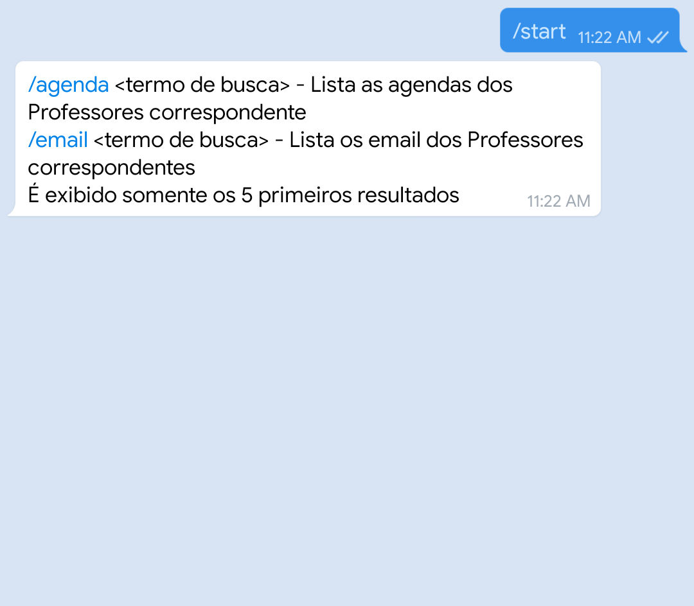
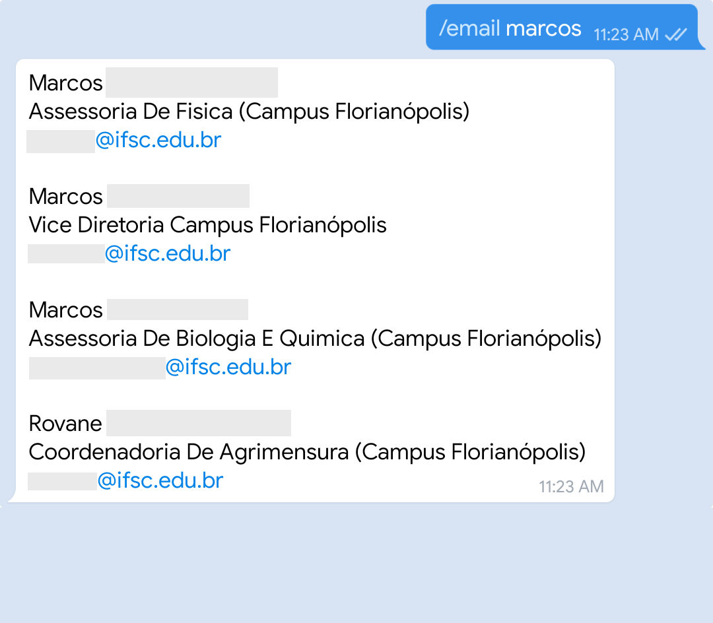
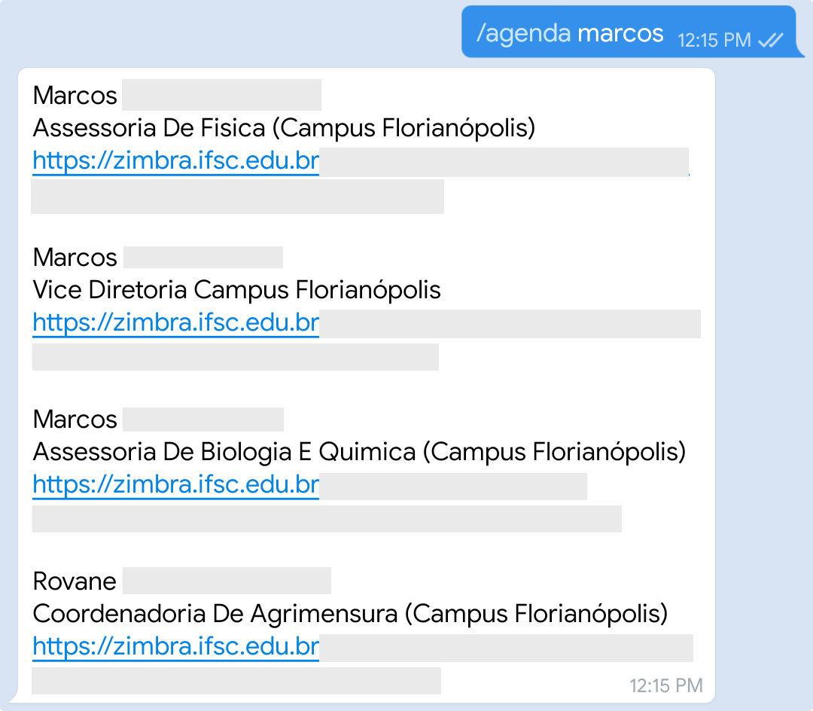

## ARQUIVAMENTO
A bastante tempo este projeto não sobre atualizações, e por isso, estou arquivando ele.
Eu já terminei o meu curso no IFSC, além disso a minha vida profissional me tomou bastante tempo e sinto que já passou o momento deste projeto.

Eu acho que este projeto compriu o seu objetivo, e eu fico feliz por ter ajudado algumas pessoas.


## Porquê?
* Ele foi pensado para que os alunos recebam de forma rapida as atualições do IFSC ou façam pesquisas.

* Serve para aprender a usar tecnologias como: nodejs, telegraf e PostgreSQL.

* Talvez seja possivel expandir para outras instituições que utilizem a mesma plataforma (SIGAA), caso alguém queira, estou disponível para ajudar a portar ou para esclacer qualquer duvidas. Todas as críticas ou ajuda ao desenvolvimento serão bem-vindos :)

## Funcionalidades
#### Mesmo ele não sendo oficial, ele contém várias funcionalidades




### Notificações
* Em grupos ou chat privado
* Alteração em suas notas sem dizer o valor
* Notícias postadas por seus professores
* Tópico de aula
* Envio de Arquivo
* Tarefas
* Também notifica sobre questionário, vídeos, 'conteúdo'
* Envio do Plano de ensino do SIGAA em formato PDF, necessário ter o LaTeX instalado
 
### Comandos
* Busca de email e agenda de professor
`/agenda <nome do professor ou da turma>` ou `/email <nome do professor ou da turma>`
* Buscar atendimento `/atendimento`
* ver o plano de ensino `/plano` - Os planos de ensino são documentos PDFs criados pelo bot que contém o conteúdo da disciplina.
* Ver as notas `/vernotas` 
* Forçar atualização `/atualizar`


## Para executar:
* Instalar o nodejs
* Instalar o LaTeX
* Instalar o PostgreSQL (Serve para o armazenamento do estado do bot)
* Configurar uma database no PostgreSQL
* Instalar as dependências do projeto
use `npm install` ou `yarn`
* Crie seu bot no telegram e pegue o token. veja a [Documentação do Telegram](https://core.telegram.org/bots#6-botfather).
* É necessário criar um arquivo chamado `.env` com suas credenciais do SIGAA, seu token do passo anterior e timezone do SIGAA:
```
TZ="America/Sao_Paulo"
SIGAA_USERNAME="<seu usuário>"
SIGAA_PASSWORD="<sua senha>"
BOT_TOKEN="<seu token>"
```
* Renomear o arquivo de configuração `config.example.js` para `config.js`
* Configurar o bot usando o arquivo `config.js`
* Renomear o arquivo de configuração `database.example.json` para `database.json`
* Colocar os dados de acesso do PostgreSQL no arquivo database.json
* Instalar todos os pacotes LaTeX contidos no arquivo `texlive.packages`
* Executar `npm run migrate` para construir a estrutura do banco de dados
* Executar o arquivo com o nodejs `npm run start` ou `yarn run start`
