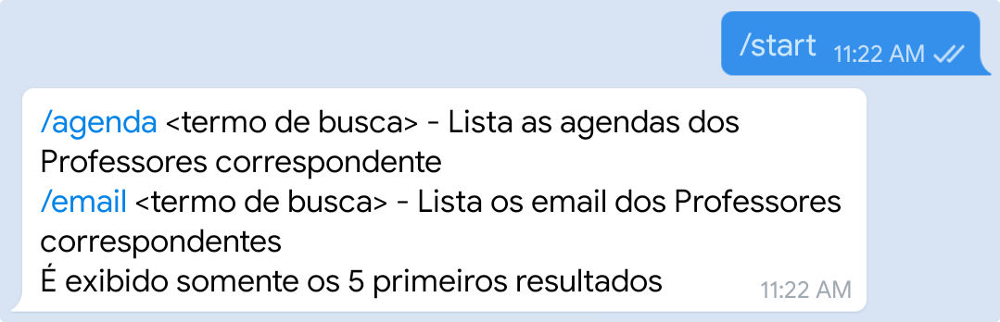
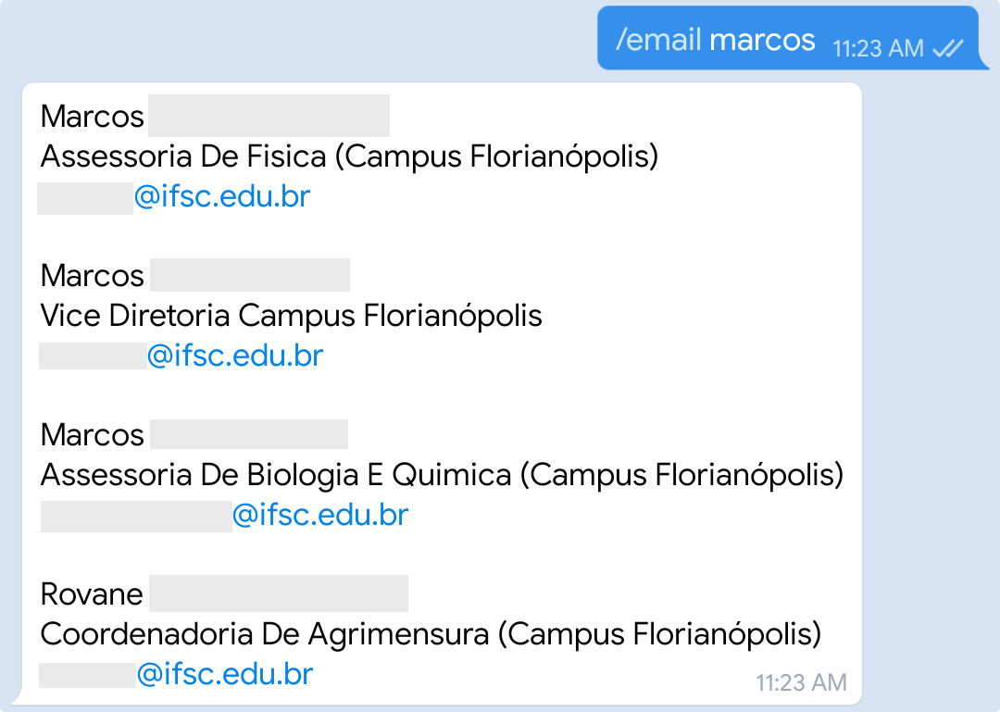

Criado para informar e acelera o uso do SIGAA.
## Disclaimer
Este bot não é oficial.
Eu sou estudante do IFSC, onde desenvolvo este projeto em tempo livre, usando .

## Funcionalidades


### Notificações
* Em grupos ou chat privado
* Alteração em suas notas sem dizer o valor
* Notícias postadas por seus professores
* Tópico de aula
* Envio de Arquivo
* Tarefas
* Também notifica sobre questionário, vídeos, 'conteúdo da web'
 
### Comandos
* Busca de email e agenda de professor
`/agenda <nome do professor ou da turma>` ou `/email <nome do professor ou da turma>`
* Ver as notas `/viewgrades` 
* Forçar atualização `/forceupdate`
 
## Para executar:
* Instalar o nodejs
* Instalar as dependências do projeto
use `npm install` ou `yarn`
* Crie seu bot no telegram e pegue o token. veja a [Documentação do Telegram](https://core.telegram.org/bots#6-botfather).
* É necessário criar um arquivo chamado `.env` com suas credenciais do SIGAA, seu token do passo anterior e timezone do SIGAA:
```
TZ="America/Sao_Paulo"
SIGAA_USERNAME="<seu usuário>"
SIGAA_PASSWORD="<sua senha>"
BOT_TOKEN="<seu token>"
```
* Renomear o arquivo de configuração `config.example.js` para `config.js`
* Configurar o bot usando o arquivo `config.js`
* Executar o arquivo com o nodejs `npm run start` ou `yarn run start`